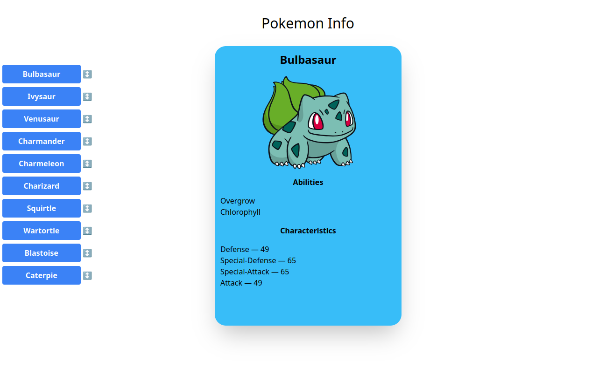

# Pokemon Info Test task



Create a React app and publish it on Github
https://pokeapi.co/ — use this API

- [x] The application should include a single page
- [x] The page displays a choice of a list of 10 or 30 pokemons
- [x] Clicking on a name on the right side displays the pokémon's photo, name, abilities, and 4 arbitrary characteristics
- [x] For 5-10 random abilities translation is added if there is no translation the original is shown
  - Pokemon abilities < 4 in the first 10 pokemons and for all of them alredy present english translation
- [x] List items can be moved (React-Draggable or react-beautiful-dnd library)
  - react-beautiful-dnd Deprecated. Replaced by @hello-pangea/dnd without persist state
- [x] Added Types (only on query response)
- [x] Styling is arbitrary
- Tools: Redux Toolkit RTK Query, TypeScript, react hooks, React-Draggable

## React + TypeScript + Vite

This template provides a minimal setup to get React working in Vite with HMR and some ESLint rules.

Currently, two official plugins are available:

- [@vitejs/plugin-react](https://github.com/vitejs/vite-plugin-react/blob/main/packages/plugin-react/README.md) uses [Babel](https://babeljs.io/) for Fast Refresh
- [@vitejs/plugin-react-swc](https://github.com/vitejs/vite-plugin-react-swc) uses [SWC](https://swc.rs/) for Fast Refresh

## Expanding the ESLint configuration

If you are developing a production application, we recommend updating the configuration to enable type aware lint rules:

- Configure the top-level `parserOptions` property like this:

```js
export default tseslint.config({
  languageOptions: {
    // other options...
    parserOptions: {
      project: ['./tsconfig.node.json', './tsconfig.app.json'],
      tsconfigRootDir: import.meta.dirname,
    },
  },
});
```

- Replace `tseslint.configs.recommended` to `tseslint.configs.recommendedTypeChecked` or `tseslint.configs.strictTypeChecked`
- Optionally add `...tseslint.configs.stylisticTypeChecked`
- Install [eslint-plugin-react](https://github.com/jsx-eslint/eslint-plugin-react) and update the config:

```js
// eslint.config.js
import react from 'eslint-plugin-react';

export default tseslint.config({
  // Set the react version
  settings: { react: { version: '18.3' } },
  plugins: {
    // Add the react plugin
    react,
  },
  rules: {
    // other rules...
    // Enable its recommended rules
    ...react.configs.recommended.rules,
    ...react.configs['jsx-runtime'].rules,
  },
});
```
